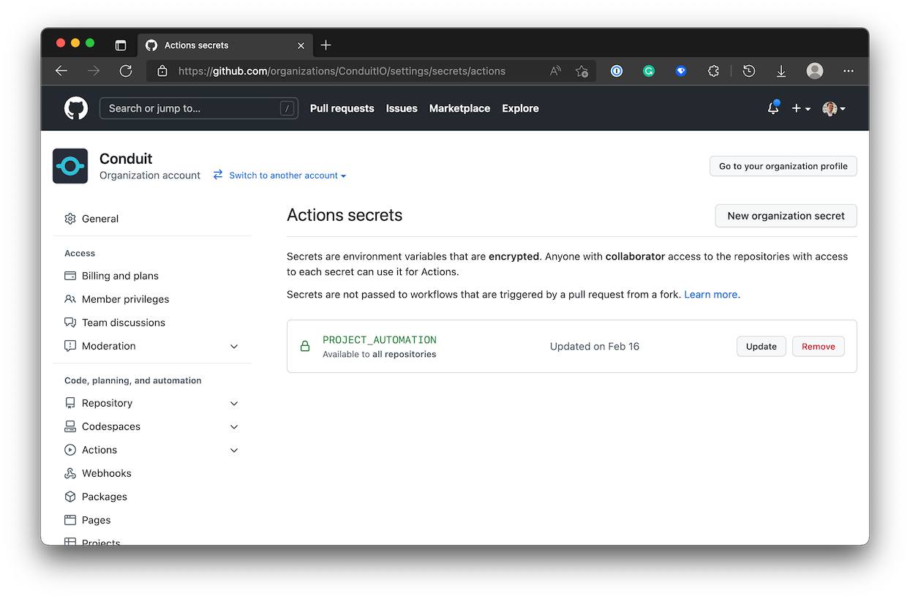

# Roadmap Automation

The roadmap for Conduit is communicated via a [GitHub Project](https://github.com/orgs/ConduitIO/projects/3) and uses [Milestones](https://github.com/ConduitIO/conduit/milestones) to organize each release cycle. The Conduit core team automates as many of the processes as possible so that the roadmap is always a reflection of current state.

## Principles & Workflow Rules

* Any issue in the repo that gets tagged with `roadmap` is a must have for that milestone.
* Releases should have a consistent cadence
* A roadmap issue that doesn't make it into a release will get moved to the next release.
* When a release does happen, communciate what made it into the release and what got moved in the repo's Discussions section
* Sometimes bugs and keep the lights on work needs to happen during a release and that's not necessarily roadmap work.
* When a non-roadmap item does get delivered in a release, add that issue to the roadmap project
* If an issue has its `roadmap` label removed, it will be removed from the roadmap

### Actions

A handful of actions and workflows power all of the principles that the core team abides by for roadmap development. For more information on what each action does, check out each action. Some actions are reused from the Actions Marketplace and that will be called out in the workflow file.

* [Remove Issue From Project](https://github.com/ConduitIO/automation/tree/main/actions/remove_issue_from_project)
* [Check for Old Milestones](https://github.com/ConduitIO/automation/tree/main/actions/check_for_old_milestones)
* [Manage Milestones](https://github.com/ConduitIO/automation/tree/roadmap-automation/actions/manage_milestones)

## Using Conduit Product Automation

⚠️  **WARNING** ⚠️  If you'd like to use Conduit Product Automation for your own project, it's recommended that you fork the repository into your own organization. The Conduit team can't guarantee that the automation will remain as-is. We're going to continue to develop this to meet the needs of our own organization and product.

### Getting Set Up

This process only works by using GitHub Actions ability to call other workflows. We're going to use the ConduitIO org, the conduit repo, and the automation repo to illustrate how to set this up.

1. Generate an API Key used for Project Automation. You'll need to go into `Developer Settings` within your Settings Menu. Once there, create a Personal Access Token. You'll need these scopes for the automation to work:
    * `public_repo`
    * `write:org`
    * `read:org`
    * `write:discussion`
    * `read:discussion`
    * `workflow`


2. With the generated token, copy that and create a new GitHub actions secret in the `conduit` repo. Make sure that you call the token `PROJECT_AUTOMATION`. It should look something like this:



3. Create a new org-level GitHub Projects (beta) board. Keep in mind that this is the new GitHub Projects not the legacy version. You'll know the difference because legacy projects only gave you the ability to use Kanban-style project management.


4. Once that project has been created, you'll need to get the project id. This id isn't the id that's used in URL for the board. You'll need to get the node id. The node id is used as a global identifier in the GitHub API. With the API key that you generated before, issue this command in your terminal to get the node id for the project. Make sure to change `ConduitIO` and `3` to the appropriate org and use the project id from the url for your project. This example uses the github command line tool to make it happen. Have that installed along with `jq`:
    ```
    $ gh api graphql -f query='
        query($org:String = "ConduitIO", $project:Int = 3) {
          organization(login:$org) {
            projectNext(number:$project) {
              id
            }
          }
        }' | jq -r '.data.organization.projectNext.id'

      PN_kwDOBL3ZPs4AAigJ
    ```


5. Now that you have the Node Id for your project, it's time to set up the workflows! There's two that you're going to need to set up.


6. In the conduit repo, we need to add a workflow to handle the issues getting updated on the board. Call the workflow file whatever you'd like. What you'll be doing is setting up some inputs to the receiving workflow. Your workflow should look like this:
    ```yaml
    name: roadmap issues

    on:
      issues:
        types: [labeled, unlabeled]

    jobs:
      roadmap:
        uses: ConduitIO/automation/.github/workflows/roadmap.yml@main
        with:
          project: PN_kwDOBL3ZPs4AAigJ
        secrets:
          project-automation-token: ${{ secrets.PROJECT_AUTOMATION }}
    ```


7. The second workflow that you'll need to add manages all of the milestones and the release notes. We call it `milestones.yml` but feel free to call it whatever you want. This should live in the `.github/workflows` directory in your repo.
    ```yaml
    name: Manage Milestones

    on:
      schedule:
        # * is a special character in YAML, so you have to quote this string
        # we want the check for milestone management to only happen on work
        # days.
        # this runs quite often. feel free to change it to suit your needs.
        - cron:  '0 0 * * 2-6'
      workflow_dispatch:

    jobs:
      milestones:
        uses: ConduitIO/automation/.github/workflows/milestones.yml@main
        with:
          org-repo: 'conduitio/conduit'
          project: PN_kwDOBL3ZPs4AAigJ
        secrets:
          project-automation-token: ${{ secrets.PROJECT_AUTOMATION }}
    ```
